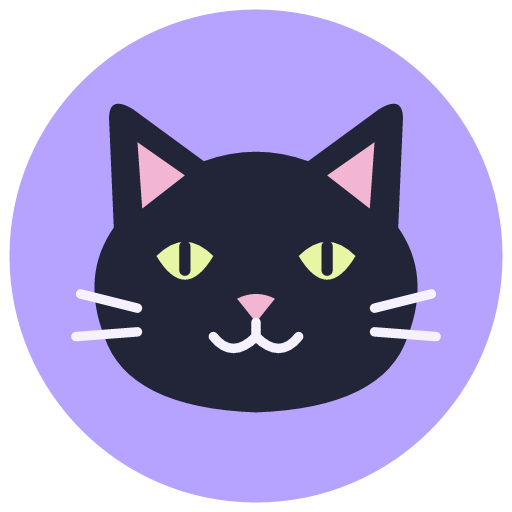

<p align="center"></p>

# Licon

Una app Android simple para personalizar tu pantalla de inicio: elegí una aplicación, cargá un PNG y ajustá el tamaño del icono. **Transparencia real, sin marco agregado y sin insignias.**

## Descargar

El APK firmado está disponible en [Releases](https://github.com/lferraro1103/Licon/releases/latest).

Requiere **Android 8.0 o posterior**. Probada en un **Samsung Galaxy Z Fold 6 con Android 16 y One UI Home**.

## Cómo se usa

1. Abrí Licon y seleccioná la aplicación que querés abrir. Podés buscar por nombre o paquete.
2. Elegí un archivo **PNG** desde el selector de archivos.
3. Ajustá el tamaño del **25% al 100%** y, si querés, cambiá el nombre.
4. Tocá **Agregar al inicio** y confirmá **Añadir** en el launcher.

Licon crea un **widget transparente de 1×1** que abre directamente la aplicación elegida. Esta implementación evita la insignia que Android agrega a los accesos directos tradicionales. El nombre se usa para accesibilidad; el widget muestra solamente el PNG.

El control de tamaño escala la imagen dentro de la celda. El launcher decide el tamaño de esa celda. Cada acceso conserva su propia imagen y aplicación; cambiar el borrador no cambia los accesos anteriores. Para quitar uno, mantenelo pulsado en el inicio y elegí eliminar.

Si actualizás desde la versión inicial «Accesos PNG», los accesos tradicionales antiguos conservan su insignia: borrarlos y crearlos nuevamente con Licon.

## Wigreen: widgets en una app separada

Desde la versión 1.5, Licon vuelve a dedicarse únicamente a iconos PNG. **Wigreen** es otra app, con identificador `ar.wigreen`, que incluye el reloj con fecha/clima y la barra Google en verde salvia. Su fuente está en [Wigreen](Wigreen/README.md) y su APK en Releases.

Al actualizar Licon, sus accesos PNG conservan datos y widgets. Los widgets de clima y Google de versiones anteriores deben agregarse nuevamente desde Wigreen: Android no transfiere widgets entre paquetes. La ubicación se selecciona nuevamente en Wigreen.

## Privacidad

- Licon no solicita permisos de Internet ni clima, no incluye anuncios ni cuentas.
- No solicita permisos de almacenamiento: usa el selector de documentos de Android.
- El PNG y el borrador se guardan localmente en el almacenamiento privado de la app.
- Consulta solamente aplicaciones con una actividad de launcher; no solicita `QUERY_ALL_PACKAGES`.
- PNG de hasta 24 MB, con decodificación limitada a 1024 px para controlar el uso de memoria.

## Compilar

Proyecto nativo **Java**, sin dependencias de ejecución externas.

Requisitos: **JDK 17**, Android SDK **35** y conexión para descargar las herramientas de compilación. El wrapper usa **Gradle 8.9** y Android Gradle Plugin **8.7.3**.

Configurá `ANDROID_HOME`, o creá `local.properties` con `sdk.dir` apuntando a tu SDK.

```powershell
# Windows
.\gradlew.bat assembleDebug
```

```sh
# Linux / macOS
sh ./gradlew assembleDebug
```

El APK queda en `app/build/outputs/apk/debug/app-debug.apk`. El APK debug usa otra firma y no puede actualizar la versión firmada de Releases.

### Release firmado

Creá tu propia clave con `keytool` y un archivo `signing.properties` en la raíz:

```properties
storeFile=mi-clave.jks
storePassword=TU_PASSWORD
keyAlias=mi-alias
keyPassword=TU_PASSWORD
```

```powershell
.\gradlew.bat assembleRelease lintRelease
```

El APK se genera en `app/build/outputs/apk/release/app-release.apk`. Las claves de firma y contraseñas no se publican en este repositorio. Para actualizar una instalación se necesita conservar la misma clave.

## Pruebas

Con la firma release configurada y un teléfono conectado por ADB:

```powershell
.\gradlew.bat assembleRelease assembleReleaseAndroidTest
adb install -r app/build/outputs/apk/release/app-release.apk
adb install -r app/build/outputs/apk/androidTest/release/app-release-androidTest.apk
adb shell am instrument -w ar.accesospng.test/ar.accesospng.WidgetInstrumentation
```

La prueba verifica transparencia del PNG guardado, fondos transparentes de `RemoteViews`, ausencia de superposiciones, renderizado de la imagen y soporte de fijación de widgets. No modifica el borrador del usuario.

Compilación, Android Lint, firma APK y pruebas de renderizado verificadas en el Fold 6. El usuario validó visualmente la versión sin marcos ni insignias. El plegado físico y otros modelos/versiones de Android no se probaron.

## Icono

Gato negro dentro de un círculo lila. El recurso Android es un `VectorDrawable`; en `docs/` están las versiones SVG y PNG. El icono de Licon es independiente del PNG elegido para cada acceso.

## Versiones

- **1.5:** separación de apps: Licon solo para iconos PNG; Wigreen para reloj/clima y barra Google.
- **1.4:** barra de búsqueda Google con diseño salvia/oliva, búsqueda, voz y Lens.
- **1.3:** widget transparente de hora, fecha y clima de Samsung, con verde oliva y contenido centrado; selección de ubicación y botón para abrir Samsung Clima.
- **1.2 — Licon:** nuevo nombre e icono circular de gato.
- **1.1:** widgets transparentes sin insignias, conservando selección y tamaño.
- **1.0:** primera versión con accesos directos tradicionales.

El identificador `ar.accesospng` se conserva para que Licon actualice la instalación existente y mantenga los datos.


